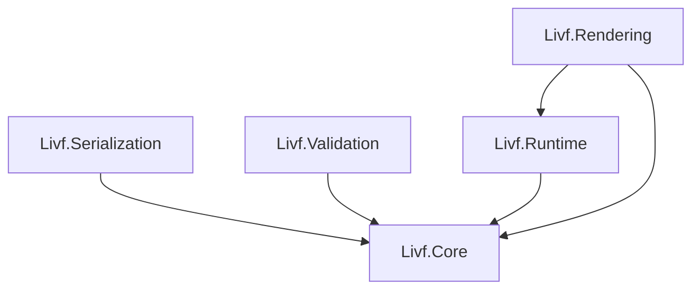
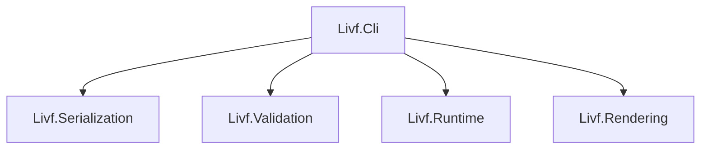

# LIVF v0.1.0 C#参照実装 方針書

**日本語** | [English](reference-runtime.md)

## 1. このドキュメントについて

このドキュメントは、LIVF v0.1.0に対応するC#参照実装について、**実装全体で共有する方針を整理すること**を目的とする。

ここで扱うのは、主に次の内容である。

- 各プロジェクトが何を担当するか
- プロジェクト間をどの方向に依存させるか
- LIVFの宣言データと実行時状態をどのように分けるか
- State、StateGroup、Default Snapshotなどを実装する上での基本的な考え方
- どの順序で実装を進めるか

個々のクラス構成、詳細なAPI、内部データ構造、使用ライブラリなどを、このドキュメントで固定することは目的としない。

詳細な設計が必要になった場合は、実装時にIssue、テスト、コード、必要に応じて個別の設計文書で扱う。

LIVFファイル形式そのものの挙動については、LIVF v0.1.0仕様書を正とする。

---

## 2. 参照実装の目的

C#参照実装では、LIVF v0.1.0について、次の一連の処理を実行できる状態を目指す。

```text
.livf
  ↓
読み込み
  ↓
仕様検証
  ↓
Runtime生成
  ↓
状態操作
  ↓
描画
```

参照実装には、次の役割を持たせる。

- LIVF v0.1.0仕様が実際に実装可能であることを確認する
- 仕様で定めた挙動を確認できる基準となる実装を提供する
- サンプルファイルやテストを用いて、仕様と実装の整合性を確認する
- Unity RuntimeやWeb Runtimeなど、将来の実装を検討する際の参考とする

ただし、C#参照実装で採用した内部設計を、他のLIVF実装にも要求するものではない。

---

## 3. 基本方針

### 3.1 宣言データと実行時状態を分離する

LIVFファイルから読み込んだ情報と、実行中に変化する状態は分けて管理する。

```text
Document
= LIVFファイルに記述された内容

Runtime State
= 現在の表示状態や不透明度など
```

例えばRuntimeからNodeを表示状態に変更しても、Documentに記録されている元の`visible`値そのものは変更しない。

DocumentはLIVFファイルの内容を表すモデルとして扱い、Runtime StateはState適用やアプリケーションからの操作によって変化する現在状態として扱う。

この分離は、Default SnapshotやGroup Baselineなど、ファイルに記述された状態を基準とする処理にも利用する。

### 3.2 状態管理と描画を分離する

LIVFの状態を決める処理と、その状態を画像として描画する処理は分離する。

```text
Runtime
= 何を表示するかを決める

Rendering
= その状態をどう描画するかを担当する
```

State、StateGroup、`exclusive` Folderなどの状態管理をRenderer側で再実装しない。

これにより、将来UnityやWebで描画方法が変わっても、LIVFの状態管理と描画方式を切り離して考えられるようにする。

### 3.3 各プロジェクトの責務を明確にする

参照実装を一つの大きなライブラリにはまとめず、役割ごとに分割する。

想定する構成は次のとおり。

```text
src/
├─ Livf.Core/
├─ Livf.Serialization/
├─ Livf.Validation/
├─ Livf.Runtime/
└─ Livf.Rendering/

tools/
└─ Livf.Cli/
```

分割そのものを目的にはせず、異なる責務が一つのプロジェクトへ混ざらないことを重視する。

---

## 4. プロジェクト間の依存関係

### 4.1 ライブラリ間の依存関係

参照実装を構成するライブラリ間では、基本的に次の依存関係とする。

以下の図では、**矢印の元が矢印の先に依存する**。



それぞれの関係は次のとおり。

- `Livf.Serialization`は、読み込んだLIVFをCoreのモデルとして生成する
- `Livf.Validation`は、Coreのモデルを対象に仕様適合性を検証する
- `Livf.Runtime`は、Coreのモデルをもとに実行時状態を管理する
- `Livf.Rendering`は、CoreにあるLIVFの構造とRuntimeにある現在状態を使って描画する

特にRenderingでは、次のように情報を使い分ける。

```text
Livf.Core
├─ Canvas
├─ Node階層
├─ Layerのsource
├─ Layerの座標
└─ 描画順などの宣言情報

Livf.Runtime
├─ 現在のvisible
└─ 現在のopacity
```

そのため、RenderingはCoreとRuntimeの両方へ依存する。

### 4.2 CLIの依存関係

`Livf.Cli`は、参照実装を構成する各ライブラリを組み合わせて利用する側に置く。



CLI内部にはLIVFの主要な処理を独自実装せず、各ライブラリが提供する機能を呼び出して処理を組み立てる。

例えば、

```text
validate
→ Serialization + Validation

render
→ Serialization + Validation + Runtime + Rendering
```

のように利用する。

### 4.3 依存関係の原則

プロジェクト間では、次の原則を維持する。

- `Livf.Core`は他のLIVFプロジェクトへ依存しない
- Serialization、Validation、RuntimeはCoreのモデルを共通して利用する
- RenderingはCoreの宣言情報とRuntimeの現在状態を利用する
- CLIは各ライブラリを組み合わせる利用側とする
- CoreやRuntimeなどの下位レイヤーから、CLI、Editor、Unityなどの上位機能へ依存しない
- 循環依存を作らない

`.livf`コンテナ内の画像など、リソースへのアクセス方法については、この時点では具体的な型やAPIを固定しない。

ただし、ValidationやRenderingが`.livf` ZIPを独自に開き直す構造にはせず、Serializationで得られたリソース情報またはリソースアクセス手段を外部から受け取れる形を基本とする。

---

## 5. 各プロジェクトの役割

### 5.1 Livf.Core

`Livf.Core`は、**LIVFをC#上で扱うための共通モデルと、そのモデル自身で完結する基本的な操作を提供する。**

主に次のようなLIVFの概念を扱う。

```text
Document
Metadata
Canvas

Node
├─ Layer
└─ Folder

State
Change
StateGroup
```

これらは単なるデータ格納用の型ではなく、LIVFの構造や各要素の関係をC#上で表現するモデルとして扱う。

そのため、モデルだけで完結する基本的な処理についてはCoreに含めることができる。

例えば次のような処理が考えられる。

- Document内のNodeを参照する
- Node階層を走査する
- Folderの子Nodeを取得する
- LIVFモデル上の要素同士の関係を調べる

一方、外部の責務を必要とする処理はCoreでは扱わない。

```text
.livfやJSONを読み込む
→ Serialization

LIVF v0.1.0仕様への適合性を検証する
→ Validation

現在のvisibleやopacityを変更する
→ Runtime

PNGを読み込んで画像を合成する
→ Rendering
```

Serialization、Validation、Runtime、Renderingは、このCoreのモデルを共通の前提として利用する。

Coreはできるだけ軽量に保ち、ZIP、JSONライブラリ、画像処理ライブラリ、CLI、Unityなど、特定の入出力や実行環境への依存を持たせない。

---

### 5.2 Livf.Serialization

`Livf.Serialization`は、`.livf`ファイルをC#上で扱える形へ読み込む責務を持つ。

主に次の処理を担当する。

- `.livf`をZIPコンテナとして開く
- `manifest.json`を読み込む
- JSONからCoreのモデルを生成する
- コンテナ内の画像などを参照できるようにする
- コンテナのパスを安全に扱う

Serializationの役割は、**保存されたLIVFを、他のコンポーネントが扱える状態へ変換すること**である。

JSONとして読み取れた内容がLIVF仕様上正しいかどうかは、Validationの責務とする。

```text
Serialization
= 読み込む

Validation
= 正しいか確認する
```

また、画像などのコンテナ内リソースについても、後続の処理が利用できる形でアクセス手段を提供する。

その具体的なAPIやリソース管理方法は、このドキュメントでは固定しない。

---

### 5.3 Livf.Validation

`Livf.Validation`は、読み込まれた内容がLIVF v0.1.0仕様に適合しているかを確認する。

例えば次のような項目を扱う。

- IDの重複
- Canvasサイズ
- Node、State、StateGroup間の参照
- `defaultChild`
- `defaultState`
- StateGroupの`targets`
- opacityの範囲
- Layerから参照された画像の存在
- 不正なリソースパス
- 排他的なStateGroup間の管理範囲

Validationは、**LIVFとして正しいかどうか**を判断する。

作者の意図を推測して改善を提案する処理は、ValidatorではなくLintとして扱い、仕様適合性の検証とは分離する。

Validation自身が`.livf`ファイルを開くのではなく、Documentや必要なリソース情報を受け取って検証する形を基本とする。

---

### 5.4 Livf.Runtime

`Livf.Runtime`は、LIVFの実行時状態と、その状態を変更する操作を担当する。

主に次の機能を扱う。

- Runtime State
- Nodeの表示・非表示
- opacity
- `multiple` / `exclusive` Folder
- State
- StateGroup
- Group Baseline
- Default Snapshot
- `ResetToDefault`
- StateGroupのActive State

Runtimeでは、Documentの宣言値を現在状態として直接書き換えない。

概念的には、次の情報を分けて保持する。

```text
LivfRuntime
├─ Document
├─ Runtime State
├─ Default Snapshot
└─ Group Baselines
```

DocumentはLIVFファイルに記述された内容を表し、それ以外の3つはRuntimeが状態管理のために保持する情報である。

---

### 5.5 Livf.Rendering

`Livf.Rendering`は、Document、Runtime State、画像リソースをもとに、現在のLIVFを画像として描画する。

LIVF v0.1.0では主に次を扱う。

- 透明Canvasの生成
- Node階層の走査
- Runtime Stateに基づく表示判定
- Layer画像の取得
- Layer座標の反映
- Folderを含めた実効opacity
- 通常アルファ合成
- Canvas外のクリッピング

Rendererは、StateやStateGroupを適用して状態を作る責務を持たない。

Runtimeによってすでに決定された状態を、仕様に従って画像へ変換することに集中する。

また、Renderer自身が`.livf` ZIPを開いてmanifestを読み直すことはせず、必要なDocument、Runtime State、画像リソースへのアクセス手段を受け取る形とする。

---

### 5.6 Livf.Cli

`Livf.Cli`は、参照実装を実際に利用するための開発・検証用ツールとして扱う。

例えば、次のような操作を想定する。

```text
inspect
validate
render
```

CLI内部にLIVFの主要なロジックを独自実装するのではなく、Serialization、Validation、Runtime、Renderingを組み合わせて利用する。

CLIは参照実装の動作確認や、サンプルファイルの検証にも利用できるようにする。

---

## 6. Runtime State

Runtimeでは、Nodeの現在状態をDocumentとは別に保持する。

v0.1.0では、少なくとも次の情報がRuntime Stateに含まれる。

```text
Visible
Opacity
```

例えばDocument上で、

```text
visible = false
```

と宣言されているNodeをRuntimeから表示した場合でも、Document側の値は変更しない。

```text
Document
visible = false

Runtime State
visible = true
```

Documentは「ファイルに何が書かれていたか」を保持し、Runtime Stateは「現在どうなっているか」を保持する。

---

## 7. Folderの排他制御

`selectionMode = exclusive`のFolderでは、一度に表示できる直接の子Nodeを最大1つに制限する。

例えば次のFolderがある場合、

```text
eyes [exclusive]
├─ normal
├─ smile
└─ closed
```

`smile`を表示すると、同じFolderに属する他の直接の子は非表示になる。

```text
normal = false
smile  = true
closed = false
```

そのため、Runtime上の表示変更は単純な`Visible`値の書き換えではなく、必要に応じてFolderの排他ルールも解決する。

仕様で定められた親Folderの表示処理についてもRuntimeで扱う。

---

## 8. Stateの適用

Stateは、現在のRuntime Stateに対する変更として扱う。

State内のChangeは、仕様で定められた順序に従って適用する。

また、State適用はアトミックである必要があるため、処理途中の状態を現在状態として公開しない。

概念的には次の流れになる。

```text
現在のRuntime State
        ↓
     一時状態
        ↓
Changeを順番に適用
        ↓
排他ルールを解決
        ↓
Runtime Stateへ反映
```

一時状態をどのようなデータ構造で実現するか、どの程度コピーするかといった内部実装は、この方針書では決めない。

---

## 9. StateGroupとGroup Baseline

通常の`SetState`と、StateGroupを通したState選択は区別して扱う。

`exclusive` StateGroupでStateを切り替える場合は、まずそのStateGroupが管理する範囲をGroup Baselineへ戻してから、新しいStateを適用する。

```text
現在状態
   ↓
targetsをGroup Baselineへ戻す
   ↓
指定されたStateを適用
   ↓
Folderの排他ルールを解決
   ↓
Active Stateを更新
   ↓
現在状態へ反映
```

Group Baselineは、仕様に従い次の情報を基準として構築する。

- Nodeの`visible`
- Nodeの`opacity`
- Folderの`defaultChild`
- Folderの排他ルール

次の情報はGroup Baselineには含めない。

- StateGroupの`defaultState`
- ファイル全体の`defaultState`

また、StateGroupの管理対象となっているNodeをアプリケーションから直接変更し、現在状態が特定のStateと一致することを保証できなくなった場合、そのStateGroupのActive Stateは未確定として扱う。

---

## 10. Default Snapshot

Runtime生成時には、LIVF v0.1.0仕様で定められた初期化処理を適用し、最終的な初期状態を構築する。

状態の構築では、概ね次の順序で各要素が反映される。

```text
Nodeのvisible / opacity
        ↓
FolderのdefaultChild
        ↓
StateGroupのdefaultState
        ↓
ファイル全体のdefaultState
        ↓
排他ルールを解決
```

完成した状態をDefault Snapshotとして保存し、その状態を初期Runtime Stateとする。

`ResetToDefault()`では、Default StateというStateを単純に再適用するのではなく、保存されたDefault Snapshotへ現在状態を復元する。

これにより、

```text
読み込み直後の状態
=
ResetToDefault()直後の状態
```

を保証する。

---

## 11. Rendering

描画処理では、Runtimeで決められた現在状態をもとにNode階層を描画する。

基本的な流れは次のとおり。

```text
透明Canvasを生成
        ↓
Nodeを定義順に走査
        ↓
現在の表示状態を確認
        ↓
Layer画像を取得
        ↓
実効opacityを計算
        ↓
指定座標へ描画
        ↓
通常アルファ合成
        ↓
Canvas外をクリッピング
```

LIVF v0.1.0では、PNGと通常アルファ合成を対象とする。

具体的な画像処理ライブラリや内部の画像表現については、この方針書では固定しない。

---

## 12. 実装の進め方

参照実装は、おおむね次の順序で進める。

```text
1. Core
2. Serialization
3. Validation
4. Runtimeの基本状態管理
5. Folderの排他制御
6. Default Snapshot / ResetToDefault
7. State
8. StateGroup
9. Rendering
10. CLI / 統合確認
```

最初から描画まで一度に実装するのではなく、

```text
正しくモデル化できる
        ↓
正しく読み込める
        ↓
正しく検証できる
        ↓
正しく状態を管理できる
        ↓
正しく描画できる
```

という順序で進める。

具体的なタスクや完了条件はIssueとテストで管理する。

---

## 13. 最初の完成目標

最初の参照実装では、次の一連の流れが成立することを目標とする。

```text
LIVFファイル
    ↓
Load
    ↓
Validate
    ↓
Runtime生成
    ↓
Node / State / StateGroup操作
    ↓
Render
```

これにより、LIVF v0.1.0の主要な機能をC#上で一通り扱える状態にする。

その後、この参照実装とテストから得られた知見をもとに、Unity Runtime、Web Runtime、Editor、Importerなどへ展開する。

---

## 14. このドキュメントで決めないこと

このドキュメントは実装方針を整理するためのものであり、実装詳細を固定するためのものではない。

そのため、次の内容は原則としてここでは決めない。

- 個々のクラス名やクラス数
- 詳細なpublic API
- 内部で使用するコレクション型
- Runtime Stateの具体的な内部表現
- Snapshotのコピー方法
- キャッシュ戦略
- 画像処理ライブラリ
- JSONライブラリ
- 例外型の詳細
- 非同期処理の採用範囲
- パフォーマンス最適化の具体的な方法
- CLIの詳細なコマンド体系
- UnityやWeb固有の実装方法

実装を進める上で必要になったものから、コードやIssue、テストを通して決定する。

このドキュメントでは、各実装が細部で異なっても共有しておきたい、**責務の境界と実装全体の考え方**を扱う。
