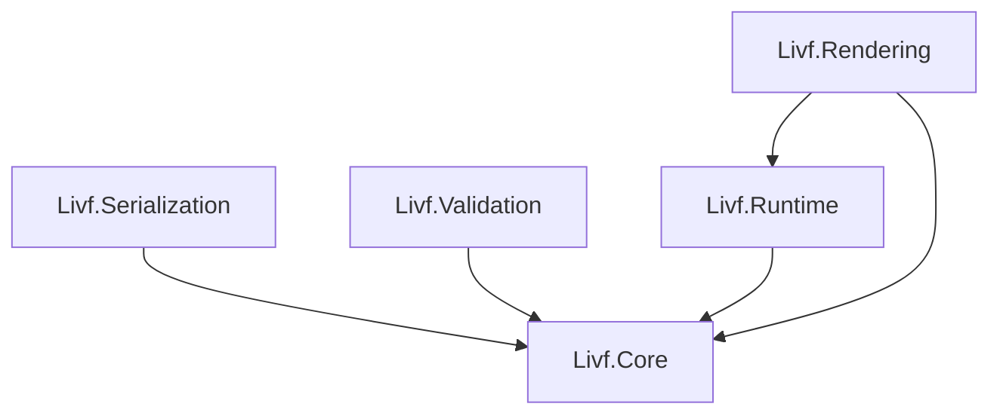
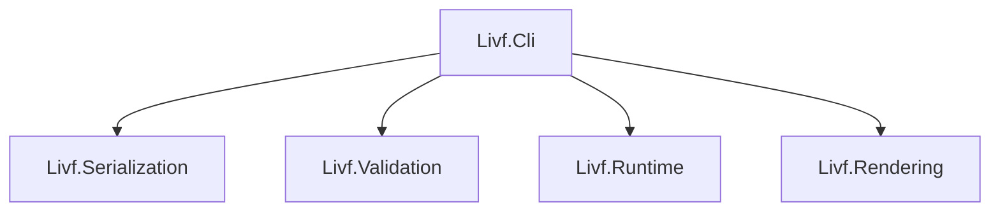

# LIVF v0.1.0 C# Reference Implementation Policy

[日本語](reference-runtime.ja.md) | **English**

## 1. About this document

This document defines the **shared implementation policy** for the C# reference implementation of LIVF v0.1.0.

It mainly covers the following topics:

- what each project is responsible for
- the direction of dependencies between projects
- how declarative LIVF data and runtime state are separated
- the basic approach to implementing concepts such as State, StateGroup, and Default Snapshot
- the order in which the implementation is developed

This document is not intended to lock down individual class structures, detailed APIs, internal data structures, or specific libraries.

When more detailed design decisions are needed during implementation, they should be handled in Issues, tests, code, or separate design documents as appropriate.

For the behavior of the LIVF file format itself, the LIVF v0.1.0 specification is authoritative.

---

## 2. Purpose of the reference implementation

The C# reference implementation aims to support the following end-to-end flow for LIVF v0.1.0:

```text
.livf
  ↓
Load
  ↓
Validate
  ↓
Create Runtime
  ↓
Manipulate State
  ↓
Render
```

The reference implementation serves the following purposes:

- verify that the LIVF v0.1.0 specification can be implemented in practice
- provide a baseline implementation whose behavior can be compared against the specification
- use sample files and tests to verify consistency between the specification and implementation
- serve as a reference when considering future implementations such as a Unity Runtime or Web Runtime

However, internal design choices made in the C# reference implementation are not requirements for other LIVF implementations.

---

## 3. Basic policy

### 3.1 Separate declarative data from runtime state

Information loaded from a LIVF file and state that changes during execution are managed separately.

```text
Document
= content declared in the LIVF file

Runtime State
= current visibility, opacity, and other runtime values
```

For example, changing a Node to visible through the Runtime does not modify the original `visible` value stored in the Document.

The Document represents the contents of the LIVF file, while Runtime State represents the current state changed by State application or application-side operations.

This separation is also used by features that need to refer back to values derived from the file, such as Default Snapshot and Group Baseline.

### 3.2 Separate state management from rendering

The logic that determines the current LIVF state is separated from the logic that renders that state as an image.

```text
Runtime
= decides what should currently be shown

Rendering
= decides how that state is drawn
```

State management for State, StateGroup, and `exclusive` Folders is not reimplemented in the Renderer.

This keeps LIVF state management independent from the rendering approach, even if future Unity or Web implementations use different drawing mechanisms.

### 3.3 Keep project responsibilities explicit

The reference implementation is divided by responsibility instead of being built as one large library.

The expected structure is:

```text
src/
├─ Livf.Core/
├─ Livf.Serialization/
├─ Livf.Validation/
├─ Livf.Runtime/
└─ Livf.Rendering/

tools/
└─ Livf.Cli/
```

The goal is not separation for its own sake, but to avoid mixing distinct responsibilities in the same project.

---

## 4. Project dependencies

### 4.1 Dependencies between libraries

The libraries that make up the reference implementation follow the dependency structure below.

In this diagram, **an arrow points from the dependent project to the project it depends on**.



The relationships are as follows:

- `Livf.Serialization` creates Core models from loaded LIVF data
- `Livf.Validation` validates Core models against the specification
- `Livf.Runtime` manages runtime state based on Core models
- `Livf.Rendering` renders using the LIVF structure in Core and the current state in Runtime

Rendering uses information from Core and Runtime for different purposes:

```text
Livf.Core
├─ Canvas
├─ Node hierarchy
├─ Layer source
├─ Layer coordinates
└─ declarative information such as draw order

Livf.Runtime
├─ current visible state
└─ current opacity
```

For this reason, Rendering depends on both Core and Runtime.

### 4.2 CLI dependencies

`Livf.Cli` sits on the consumer side and combines the libraries that make up the reference implementation.



The CLI does not reimplement LIVF's main logic internally. Instead, it composes the functionality provided by the libraries.

For example:

```text
validate
→ Serialization + Validation

render
→ Serialization + Validation + Runtime + Rendering
```

### 4.3 Dependency principles

The following principles are maintained between projects:

- `Livf.Core` does not depend on other LIVF projects
- Serialization, Validation, and Runtime share and use Core models
- Rendering uses declarative information from Core and current state from Runtime
- CLI is a consumer that combines the libraries
- lower-level projects such as Core and Runtime do not depend on higher-level features such as CLI, Editor, or Unity
- circular dependencies are not introduced

The concrete type or API used to access resources such as images inside a `.livf` container is intentionally left unspecified at this stage.

However, Validation and Rendering should not independently reopen the `.livf` ZIP. Instead, they should receive resource information or a resource-access mechanism obtained through Serialization.

---

## 5. Responsibilities of each project

### 5.1 Livf.Core

`Livf.Core` **provides the shared models used to represent LIVF in C#, along with basic operations that can be completed entirely within those models.**

It mainly covers LIVF concepts such as:

```text
Document
Metadata
Canvas

Node
├─ Layer
└─ Folder

State
Change
StateGroup
```

These are not treated as mere data containers. They represent LIVF structure and relationships between elements in C#.

Therefore, basic operations that can be completed using the model alone may also belong in Core.

Examples include:

- looking up Nodes in a Document
- traversing the Node hierarchy
- retrieving the child Nodes of a Folder
- inspecting relationships between elements in the LIVF model

By contrast, responsibilities that require external concerns do not belong in Core.

```text
Read .livf or JSON
→ Serialization

Validate conformance with the LIVF v0.1.0 specification
→ Validation

Change current visible or opacity values
→ Runtime

Read PNGs and composite images
→ Rendering
```

Serialization, Validation, Runtime, and Rendering all use the Core model as a shared foundation.

Core should remain lightweight and should not depend on specific I/O mechanisms or execution environments such as ZIP handling, JSON libraries, image-processing libraries, CLI, or Unity.

---

### 5.2 Livf.Serialization

`Livf.Serialization` is responsible for loading a `.livf` file into a form that can be used from C#.

It mainly handles:

- opening `.livf` as a ZIP container
- reading `manifest.json`
- creating Core models from JSON
- making container resources such as images accessible
- safely handling paths within the container

The role of Serialization is to **convert a stored LIVF file into a form that other components can work with**.

Whether content that can be read as JSON is valid according to the LIVF specification is the responsibility of Validation.

```text
Serialization
= load

Validation
= check whether it is valid
```

Serialization also provides a way for later processing stages to access resources such as images inside the container.

The concrete API and resource-management strategy are not fixed by this document.

---

### 5.3 Livf.Validation

`Livf.Validation` checks whether loaded content conforms to the LIVF v0.1.0 specification.

Examples include:

- duplicate IDs
- Canvas size
- references between Node, State, and StateGroup
- `defaultChild`
- `defaultState`
- StateGroup `targets`
- opacity range
- existence of images referenced by Layers
- invalid resource paths
- overlapping managed ranges between exclusive StateGroups

Validation determines **whether the data is valid LIVF**.

Checks that infer author intent and suggest improvements should be treated as Lint rather than Validator behavior, and kept separate from specification conformance validation.

Validation should not open the `.livf` file itself. Instead, it should receive the Document and any resource information it needs.

---

### 5.4 Livf.Runtime

`Livf.Runtime` is responsible for LIVF runtime state and operations that change that state.

It mainly handles:

- Runtime State
- Node visibility
- opacity
- `multiple` / `exclusive` Folder behavior
- State
- StateGroup
- Group Baseline
- Default Snapshot
- `ResetToDefault`
- StateGroup Active State

Runtime does not directly overwrite declarative values stored in the Document as the current state.

Conceptually, the following pieces of information are kept separate:

```text
LivfRuntime
├─ Document
├─ Runtime State
├─ Default Snapshot
└─ Group Baselines
```

The Document represents the content declared in the LIVF file. The other three are maintained by Runtime for state management.

---

### 5.5 Livf.Rendering

`Livf.Rendering` renders the current LIVF image using the Document, Runtime State, and image resources.

For LIVF v0.1.0, it mainly handles:

- creating a transparent Canvas
- traversing the Node hierarchy
- visibility checks based on Runtime State
- retrieving Layer images
- applying Layer coordinates
- effective opacity including Folder opacity
- normal alpha compositing
- clipping outside the Canvas

The Renderer is not responsible for applying State or StateGroup operations to construct the current state.

It focuses on converting the state already determined by Runtime into an image according to the specification.

The Renderer also does not reopen the `.livf` ZIP or reread the manifest. Instead, it receives the required Document, Runtime State, and a way to access image resources.

---

### 5.6 Livf.Cli

`Livf.Cli` is treated as a development and verification tool that uses the reference implementation.

For example, the following operations are expected:

```text
inspect
validate
render
```

The CLI does not implement LIVF's main logic independently. It combines Serialization, Validation, Runtime, and Rendering.

It should also be usable for checking the behavior of the reference implementation and validating sample files.

---

## 6. Runtime State

Runtime stores each Node's current state separately from the Document.

In v0.1.0, Runtime State contains at least:

```text
Visible
Opacity
```

For example, if a Node is declared in the Document as:

```text
visible = false
```

and Runtime changes that Node to visible, the value in the Document remains unchanged.

```text
Document
visible = false

Runtime State
visible = true
```

The Document preserves "what was written in the file," while Runtime State preserves "what the state is now."

---

## 7. Folder exclusivity

For a Folder with `selectionMode = exclusive`, at most one direct child Node may be visible at a time.

For example:

```text
eyes [exclusive]
├─ normal
├─ smile
└─ closed
```

When `smile` is made visible, the other direct children of the same Folder become hidden.

```text
normal = false
smile  = true
closed = false
```

Therefore, changing visibility in Runtime is not just a direct assignment to `Visible`; Folder exclusivity rules are resolved when needed.

Parent Folder visibility behavior defined by the specification is also handled by Runtime.

---

## 8. Applying State

A State is treated as a change applied to the current Runtime State.

Changes in a State are processed in the order defined by the specification.

State application must also be atomic, so intermediate state is not exposed as the current Runtime State.

Conceptually, the flow is:

```text
Current Runtime State
        ↓
   Temporary State
        ↓
Apply Changes in order
        ↓
Resolve exclusivity rules
        ↓
Commit to Runtime State
```

This document does not define how the temporary state is represented internally or how much data must be copied.

---

## 9. StateGroup and Group Baseline

Direct `SetState` application and State selection through a StateGroup are treated separately.

When switching State in an `exclusive` StateGroup, the range managed by that StateGroup is first restored to the Group Baseline before the new State is applied.

```text
Current state
   ↓
Restore targets to Group Baseline
   ↓
Apply selected State
   ↓
Resolve Folder exclusivity rules
   ↓
Update Active State
   ↓
Commit current state
```

The Group Baseline is built from the following information according to the specification:

- Node `visible`
- Node `opacity`
- Folder `defaultChild`
- Folder exclusivity rules

The following are not included in the Group Baseline:

- StateGroup `defaultState`
- file-level `defaultState`

If an application directly changes a Node managed by a StateGroup and the current state can no longer be guaranteed to match a specific State, that StateGroup's Active State is treated as unknown.

---

## 10. Default Snapshot

When Runtime is created, the initialization process defined by LIVF v0.1.0 is applied to construct the final initial state.

The state is built using roughly the following order:

```text
Node visible / opacity
        ↓
Folder defaultChild
        ↓
StateGroup defaultState
        ↓
file-level defaultState
        ↓
Resolve exclusivity rules
```

The resulting state is stored as the Default Snapshot and is also used as the initial Runtime State.

`ResetToDefault()` does not simply reapply the State referenced by Default State. Instead, it restores the current state to the saved Default Snapshot.

This guarantees:

```text
State immediately after loading
=
State immediately after ResetToDefault()
```

---

## 11. Rendering

Rendering draws the Node hierarchy based on the current state determined by Runtime.

The basic flow is:

```text
Create transparent Canvas
        ↓
Traverse Nodes in declaration order
        ↓
Check current visibility
        ↓
Retrieve Layer image
        ↓
Calculate effective opacity
        ↓
Draw at specified coordinates
        ↓
Normal alpha compositing
        ↓
Clip outside the Canvas
```

LIVF v0.1.0 targets PNG and normal alpha compositing.

The concrete image-processing library and internal image representation are not fixed by this document.

---

## 12. Implementation order

The reference implementation is developed roughly in the following order:

```text
1. Core
2. Serialization
3. Validation
4. Basic Runtime state management
5. Folder exclusivity
6. Default Snapshot / ResetToDefault
7. State
8. StateGroup
9. Rendering
10. CLI / integration verification
```

Rather than implementing everything through rendering at once, development proceeds in the following order:

```text
Model correctly
        ↓
Load correctly
        ↓
Validate correctly
        ↓
Manage state correctly
        ↓
Render correctly
```

Concrete tasks and completion criteria are managed through Issues and tests.

---

## 13. Initial completion target

The first reference implementation aims to support the following end-to-end flow:

```text
LIVF file
    ↓
Load
    ↓
Validate
    ↓
Create Runtime
    ↓
Manipulate Node / State / StateGroup
    ↓
Render
```

This provides a state in which the major LIVF v0.1.0 features can be exercised end to end from C#.

After that, knowledge gained from the reference implementation and tests can be used when developing the Unity Runtime, Web Runtime, Editor, Importer, and other related components.

---

## 14. What this document does not decide

This document exists to organize implementation policy, not to lock down implementation details.

Therefore, the following are intentionally not decided here:

- individual class names or class counts
- detailed public APIs
- collection types used internally
- concrete internal representation of Runtime State
- Snapshot copy strategy
- caching strategy
- image-processing library
- JSON library
- detailed exception types
- scope of asynchronous processing
- concrete performance optimizations
- detailed CLI command structure
- Unity- or Web-specific implementation approaches

These decisions should be made as they become necessary during implementation, through code, Issues, tests, or additional design documents.

This document focuses on the **responsibility boundaries and overall implementation approach** that should remain shared even when implementation details differ.
